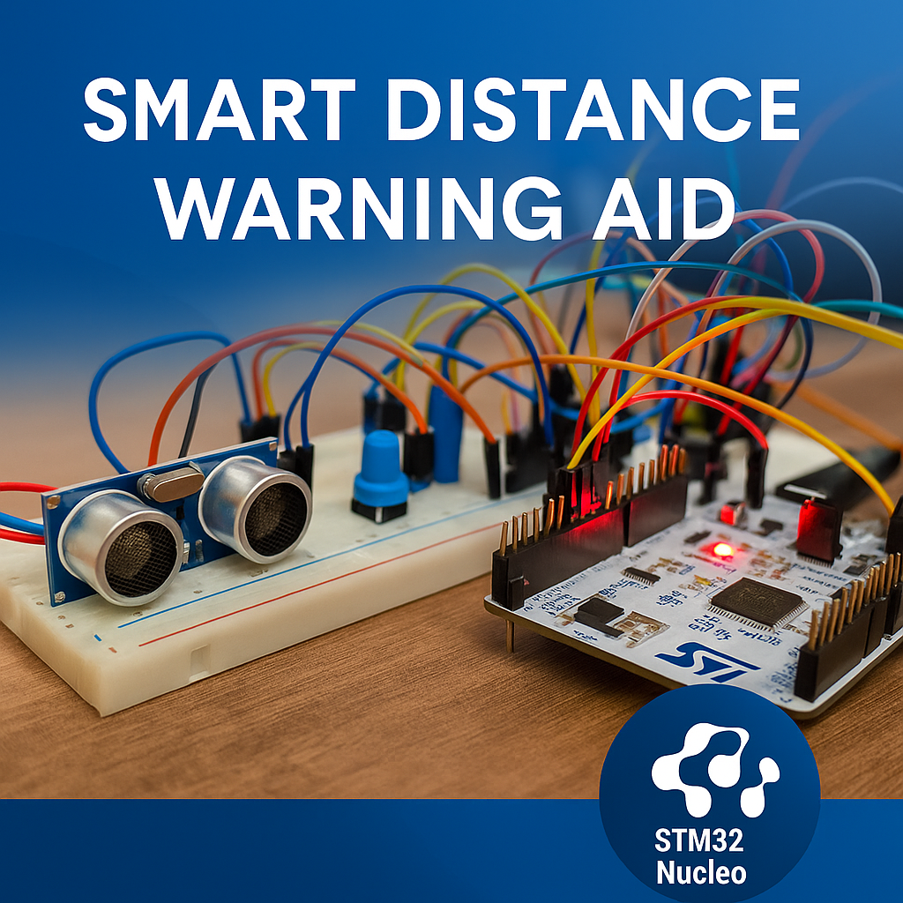

<h1 align="center">Smart Distance Warning Aid</h1>

<p align="center">
  
</p>

<p align="center"><i>
An STM32-based embedded device offering real-time distance detection using ultrasonic sensing, IR proximity validation, and multisensory alerts. Designed to assist visually impaired users through tactile, visual, and auditory feedback.
</i></p>

---

## 📦 Project Summary

This project, developed for the ENEL 351 course, presents an intelligent proximity-alert device leveraging STM32F103RB, HC-SR04 ultrasonic sensor, IR validation, and a combination of LED, buzzer, and vibration feedback. The system is designed to assist users—especially those with visual impairments—in navigating obstacles through real-time feedback based on measured distance.

---

## ⚙️ Hardware Architecture

| Component          | Pin       | Description                               |
|-------------------|-----------|-------------------------------------------|
| HC-SR04 TRIG      | `PA0`     | Trigger pulse for ultrasonic              |
| HC-SR04 ECHO      | `PA1`     | Echo pulse (TIM2 input capture)           |
| IR Proximity      | `PA5`     | Gated logic for nearby presence detection |
| LED               | `PA6`     | Distance indication via blinking pattern  |
| Buzzer            | `PA7`     | Mirrors LED alert via tone                |
| Vibration Motor   | `PA4`     | Tactile feedback at startup               |
| UART TX/RX        | `PA9/PA10`| Serial logging and debugging (PuTTY)      |

---

## 🚨 Feedback Logic

- **LED & Buzzer**: Blinking patterns increase in intensity as object approaches.
- **Vibration Motor**: Single power-on pulse confirms system startup.
- **IR Gating**: Ultrasonic measurements are validated only when IR detects presence.
- **Software Filtering**: Echo timeouts, sudden drops, and glitches are suppressed.

---

## ⏱️ Timing & Filtering Features

- **Non-blocking SysTick delay** for responsive control loop
- **TIM2 input capture** for accurate echo pulse measurement
- **Software filters** for glitch, ghost signal, and false drop rejection

---

## 🧠 System Design Highlights

<details>
<summary><b>🔁 Echo Pulse Timing (Input Capture)</b></summary>

```c
// Captures echo pulse using TIM2
uint32_t measure_distance(void) {
    uint32_t start = 0, end = 0;
    trigger_ultrasonic();
    wait_echo_rising();
    start = TIM2->CNT;
    wait_echo_falling();
    end = TIM2->CNT;

    uint32_t duration = (end >= start) ? (end - start) : (0xFFFF - start + end);
    return duration / 58;  // Convert to cm
}
```
</details>

<details>
<summary><b>🌐 IR Gating + Filtering</b></summary>

```c
if (IR_DETECTED) {
    if (distance < last_valid_distance + 20) {
        update_feedback(distance);
        last_valid_distance = distance;
    }
}
```
</details>

---

## 🧪 Project Features

- 6-level distance alert logic
- Glitch and noise suppression
- Serial debugging output (PuTTY)
- Modular, commented `main.c`
- Clean schematic in KiCad format

---

## 🧰 Tools & Technologies

- **MCU**: STM32F103RB (Nucleo-64)
- **IDE**: Keil µVision
- **EDA**: KiCad 9.0
- **Tools**: PuTTY, ADALM2000 (for waveform capture)

---

## 📝 User Guide

1. Power via USB or regulated 5V.
2. Launch PuTTY at 9600 baud.
3. Observe LED, buzzer, and motor startup sequence.
4. Place obstacles to trigger alerts.
5. Feedback escalates with object proximity.
6. Reset system by reconnecting power or pressing RESET.

---

## 🧾 Budget

| Item              | Cost (CAD) |
|-------------------|------------|
| STM32F103RB       | Provided   |
| Ultrasonic Sensor | ~$2.00     |
| IR Sensor         | ~$0.80     |
| Buzzer            | ~$1.00     |
| Vibration Motor   | ~$2.50     |
| Resistors/Wires   | Provided   |

---

## 📈 Future Enhancements

- Add OLED display for visual distance feedback
- Bluetooth or Wi-Fi module for IoT alerts
- Rechargeable battery integration
- Mobile app for logging and monitoring

---

## 👨‍💻 Author

**Gursharan Singh Rehal**  
University of Regina – ENEL 351 Final Project, Winter 2025

---

## 📎 Resources

- [📄 Project Report (PDF)](docs/Project_Report.pdf)
- [📐 Schematic Diagram (PDF)](docs/Schematic.pdf)
- [📋 Deliverables Summary (PDF)](docs/Project_Deliverables.pdf)
